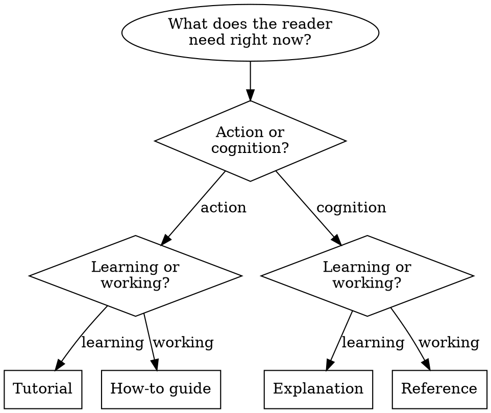

# Diataxis

Actionable reference for the Diataxis documentation framework. Based on [diataxis.fr](https://diataxis.fr/).

## Overview

Documentation serves four distinct user needs. Each demands its own mode of writing. Most documentation problems come from mixing modes — a tutorial that pauses to explain theory, a how-to guide that teaches fundamentals, reference cluttered with opinions. Keeping modes separate produces documentation that meets users where they are.

## The Compass

Before writing, classify your content along two axes:

|  | Acquisition (learning) | Application (working) |
|---|---|---|
| Action (doing) | **Tutorial** | **How-to guide** |
| Cognition (thinking) | **Explanation** | **Reference** |

Ask two questions:
1. Does this inform *action* or *cognition*?
2. Is the user *acquiring skill* or *applying skill*?

The intersection determines the documentation type.

## The Four Modes

### Tutorial — learning-oriented

The user is a beginner following your lead. You are a teacher guiding them through a meaningful exercise.

**Purpose:** Build the user's confidence and competence through hands-on experience.

**Principles:**
- Provide visible results early and often
- Narrate the expected: "You will see...", "The output should look like..."
- Minimize explanation — link to it elsewhere
- Eliminate choices and alternatives; keep the path narrow
- Use concrete steps, not abstract concepts
- Encourage repetition to build the feeling of doing
- Point out what users should notice ("Notice that...")

**Voice:** "We will...", "First, do x. Now, do y.", "You should see..."

**Analogy:** Teaching a child to cook. The dish matters less than the skills acquired and the pleasure of the experience. Lessons teach through shared activity, not lecture.

**Reliability is non-negotiable.** A tutorial that fails when followed exactly destroys learner confidence instantly.

**Keep out:** abstraction, generalization, explanation, choices, excessive information.

### How-to guide — task-oriented

The user knows what they want to accomplish. They need practical directions to get there.

**Purpose:** Help a competent user solve a specific, real-world problem.

**Principles:**
- Title clearly: "How to [accomplish X]"
- Write from the user's perspective, not the machinery's
- Address real-world complexity — users adapt guidance to varied circumstances
- Provide a logical sequence that reflects natural workflow
- Seek flow — documentation should anticipate the user's next question
- Practical usability over completeness; link to reference for exhaustive detail

**Voice:** "This guide shows you how to...", "If you want x, do y.", "Refer to the reference guide for a full list of options."

**Analogy:** A recipe. It assumes you can hold a knife and turn on an oven. It tells you how to make *this dish*, nothing more.

**Keep out:** teaching fundamentals, theory, exhaustive reference, tangential explanation.

### Reference — information-oriented

The user is working and needs to look something up. They want truth and certainty.

**Purpose:** Describe the machinery accurately so users can rely on it while working.

**Principles:**
- Describe, and only describe — no instruction, explanation, or opinion
- Mirror the product's own structure in your documentation structure
- Adopt consistent, standard patterns across all reference pages
- Provide concise usage examples without explanation
- Austere, factual tone — accuracy and precision above all

**Voice:** Declarative statements. "X accepts Y. Returns Z. Raises W when..."

**Analogy:** A map, or a food label. Standardized, reliable, factual. No recipes, no marketing.

**Keep out:** instruction, opinion, discussion, explanation, marketing.

### Explanation — understanding-oriented

The user wants to understand *why*. They're reflecting, not executing.

**Purpose:** Provide context, connections, history, and rationale that deepen understanding.

**Principles:**
- Take a higher, wider view than guides or reference
- Make connections across concepts and domains
- Provide context: design decisions, historical reasons, constraints
- Admit perspective — acknowledge alternatives, tradeoffs, opinions
- Bound by topic ("About X"), not by task or machinery
- Titles should permit an implicit "About" prefix

**Voice:** "The reason for x is because historically, y...", "W is better than z, because...", "Some users prefer w. This can work, but..."

**Analogy:** Harold McGee's *On Food and Cooking* — not recipes, not reference, but illumination that changes how practitioners think about their craft.

**Keep out:** step-by-step instructions, reference material, unbounded scope.

## Decision Flowchart

## Applying the Framework

### When reviewing existing documentation

For each section, paragraph, or sentence, ask: which mode is this? If a single page mixes modes, split the content. A tutorial paragraph that explains theory should become a link to an explanation page. A reference page with how-to steps should link to a how-to guide.

### When writing new documentation

1. Identify the user need using the compass
2. Write in that mode only — resist the pull of other modes
3. Link to other modes rather than embedding them
4. Use the voice and principles for that mode throughout

### When auditing a documentation set

Check coverage across all four quadrants. Most projects over-invest in reference and under-invest in tutorials and explanation. A rich how-to guide collection signals a mature documentation set.

## Common Mistakes

| Mistake | Symptom | Fix |
|---|---|---|
| Tutorial teaches theory | Long explanatory paragraphs interrupt hands-on steps | Move theory to explanation; link to it |
| How-to guide teaches basics | Assumes reader has never used the tool | Assume competence; link to tutorial for beginners |
| Reference includes opinions | "We recommend..." in API docs | Strip opinion; move recommendations to explanation or how-to |
| Explanation has no boundaries | Sprawling page covering everything | Bound by topic; split into focused pages |
| One page serves all needs | "Getting Started" that's tutorial + reference + how-to | Split into separate pages by mode |
| Empty structure imposed | Four sections created with no content | Let structure emerge from content; don't create empty shells |

## Quality

Diataxis addresses *deep quality* — documentation that flows, anticipates user needs, and feels right to use. It does not replace *functional quality* (accuracy, completeness, consistency). Both are necessary. Functional quality is the prerequisite; deep quality emerges when documentation respects user needs.

Improve documentation iteratively: pick a small piece, classify it, make one improvement, publish. Every step in the right direction is worth publishing immediately.
